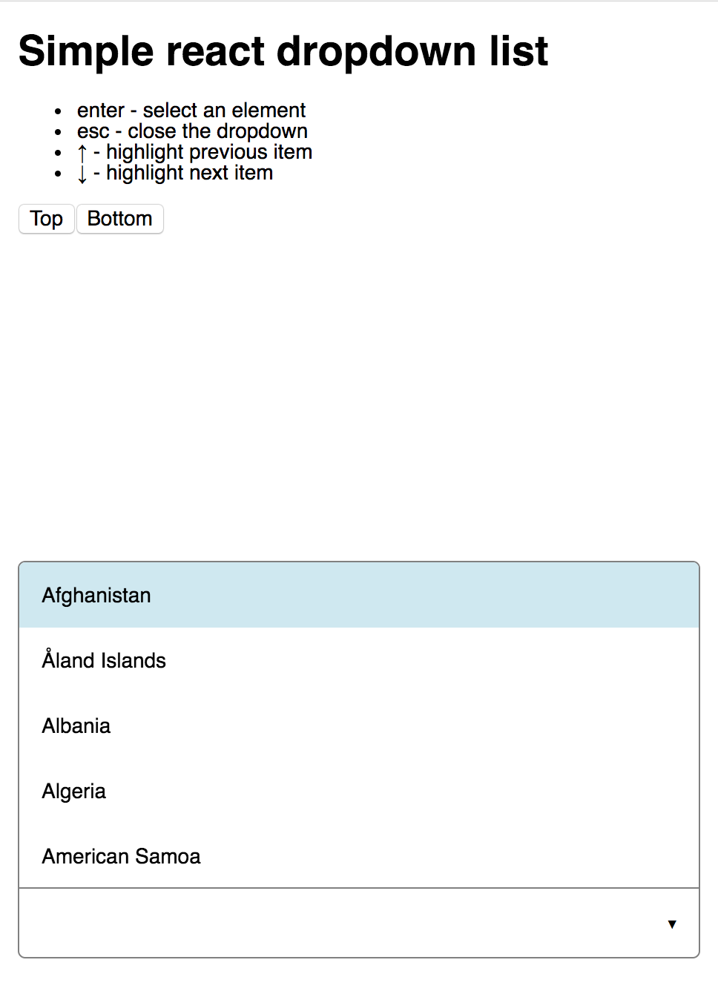
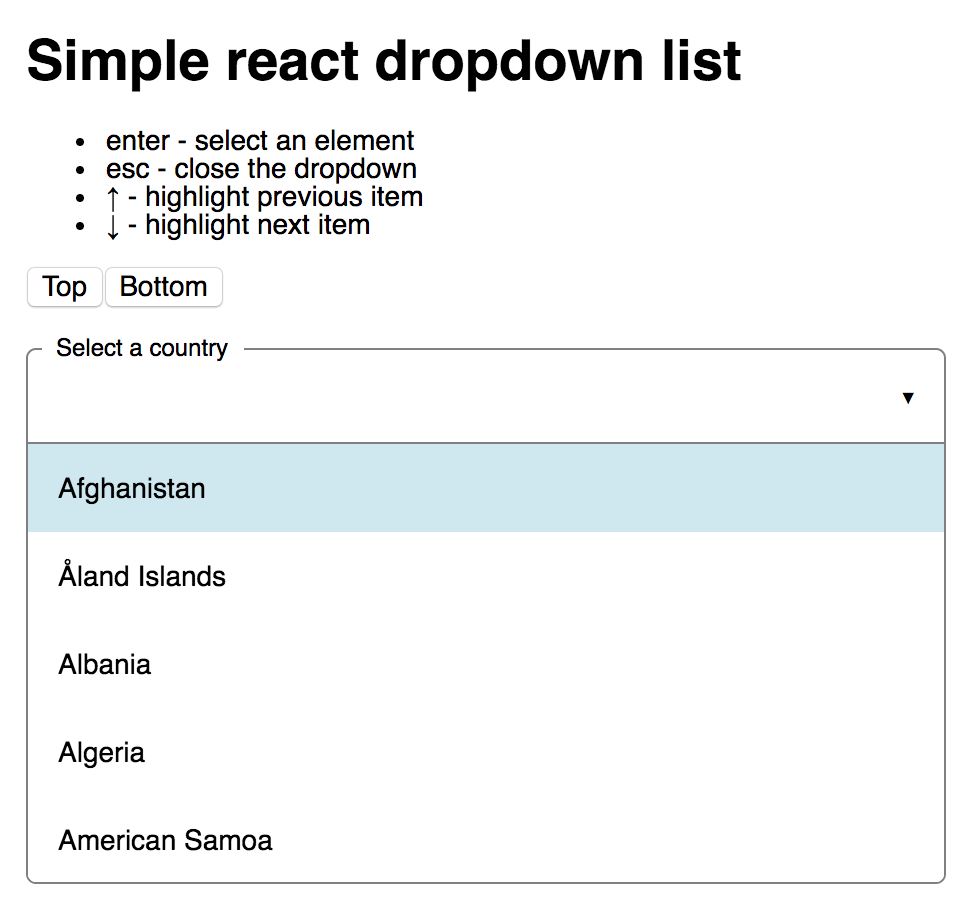
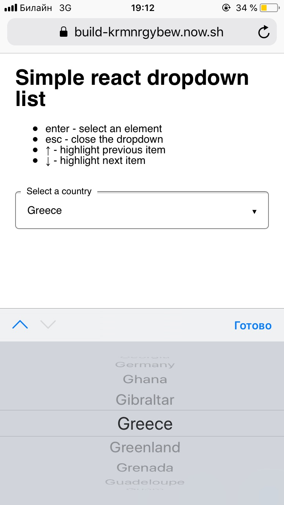

# Dropdown select component
Demo - [now.sh](https://build-krmnrgybew.now.sh/)

## Features
- Typeahead
- The list opens at the top if there's no place at the bottom
- Placeholder goes up top if the list is open to the bottom, placeholder disappears if list is open to the top
- Data is sorted alphabetically
- On mobile devices list is replaced by native select

## Screenshots

